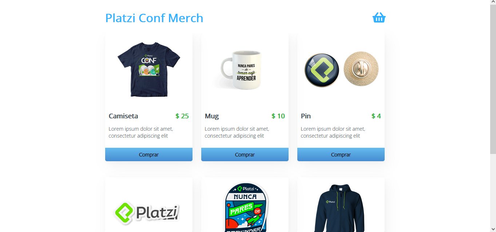

# Platzi Conf Merch

Este proyecto es una PWA (progresive web aplication) de una tienda online con productos de la Platzi-Conf y fue realizado en React.js

## Screenshot

## Link

Visitalo en [platzi-conf-merch-bb193.web.app](https://platzi-conf-merch-bb193.web.app/)

## Contenido

- [ Construcción del proyecto ](#construccion-del-proyecto)
    - [ React.js ](#react-js) 
    - [ Integración con Paypal y Google Maps ](#integracion-con-paypal-y-google-maps) 
    - [ Firebase como  Hosting ](#firebase-como-hosting)
    - [ Github Actions ](#github-actions)
    - [ SEO con Helmet ](#seo-con-helmet)
    - [ PWA ](#pwa)
- [Author](#author)

## Construcción del proyecto

### React JS

Construido con React.js, éste sitio web hace uso de las siguientes tecnologías y características:

- CSS3 con responsive design
- Webpack configurado desde cero de forma manual, Babel, ESLint con Prettier 
- React Router, Hooks

### Integración con Paypal y Google Maps

El proyecto cuenta con la configuración necesaria para integrar Paypal como medio de pago y Google Maps para mostrar al comprador su dirección en un mapa una vez realizada la compra. (Las credenciales de desarrollador no fueron agregadas pero si se desea hacer uso de este código solo basta con pasarlas mediante un archivo .env)

### Firebase como  Hosting

El sitio web se encuentra alojado en un Hosting de Firebase, el cual brinda los siguientes dominios para su visualización:

- [platzi-conf-merch-bb193.web.app](https://platzi-conf-merch-bb193.web.app/)
- [platzi-conf-merch-bb193.firebaseapp.com](https://platzi-conf-merch-bb193.firebaseapp.com/)

### Github Actions

Este proyecto cuenta con una integración con Github Actions y Firebase, en el archivo .github/workflows se encuentra la configuración necesaria para que se realice un deploy automático a producción cada vez que es enviado un commit al repositorio de Github

### SEO con Helmet

Teniendo en cuenta las problemáticas que enfrenta un sitio web construido en React al momento de ser indexado por los bots de Google, éste sitio implementa Helmet para proporsionar Meta etiquetas a las diferentes páginas

### PWA 

Este proyecto cuenta con la configuración de una PWA (progresive web aplication) lo cual nos permite su instalación como app de escritorio o app movil. Para ello se configuró un service worker, se agregó un archivo manifest y el plugin copy-webpack-plugin para copiar los archivos necesarios al compilar el proyecto

## Author

- Website - [Pablo Tachella](https://pablotachella.github.io/)
- Platzi Profile - [@PabloTachella](https://platzi.com/p/tachella/)